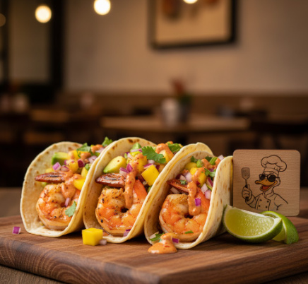
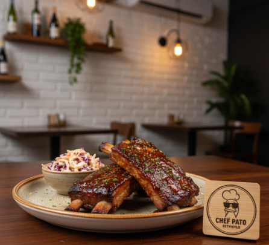

# 🦆 Pato Gourmet

Bem-vindo ao **Pato Gourmet**: o site do chef mais charmoso das lagoas! Aqui você encontra pratos irresistíveis, animações suaves e uma navegação moderna, tudo feito com carinho para quem ama comer bem.

---

## ✨ Demonstração





Veja em ação:  
Acesse o arquivo `pato-gourmet.html` em seu navegador favorito!

---

## 🚀 Como importar e usar

1. **Clone o repositório ou baixe os arquivos**
   ```bash
   git clone https://github.com/seu-usuario/pato-gourmet.git
   ```
2. **Certifique-se que a estrutura de pastas está assim:**
   ```
   pato-gourmet/
   ├── pato-gourmet.html
   └── assets/
       ├── styles/
       │   └── global.css
       ├── images/
       │   ├── logo.png
       │   ├── sobre-mim-pose.png
       │   ├── prato01.png
       │   ├── prato02.png
       │   ├── prato03.png
       │   └── icons/
       │        ├── instagram.png
       │        ├── facebook.png
       │        └── x.png
   ```
3. **Abra o arquivo `pato-gourmet.html`**  
   Você pode abrir direto no navegador ou hospedar em qualquer serviço web estático (Netlify, Vercel, GitHub Pages etc).

---

## 💡 Como customizar

- Para adicionar seus próprios pratos, edite a seção de cards dentro do arquivo HTML.
- As classes e estrutura CSS já estão prontas para suportar animações. Crie suas animações no arquivo `global.css`.

```css
/* Exemplo de animação suave para cards */
.card {
  transition: transform 0.2s;
}
.card:hover {
  transform: scale(1.04) rotate(-2deg);
}
```

- Quer mudar as imagens? Basta substituir os arquivos em `assets/images/`.

---

## 🎨 Features

- Layout responsivo 📱
- Cards animados 🃏
- Barra de pesquisa 🔎
- Menu fixo no topo 🍽️
- Links para redes sociais 🌐
- Seções para pratos, sobre, cozinha e contato 🥘

---

## 📦 Requisitos

- Navegador moderno (Chrome, Firefox, Safari, Edge)
- Não requer backend!

---

## 🛠️ Para desenvolvedores

- HTML5 + CSS3 puro
- Estrutura clara para fácil manutenção
- Pronto para deploy em qualquer serviço de páginas estáticas

---

## 🧑‍🍳 Sobre o Chef

> "Eu sou o Pato Cozinheiro, e este é o meu espaço para mostrar minha paixão pela culinária. Larguei o banho de lagoa para me dedicar a uma coisa que amo: transformar ingredientes simples em pratos que fazem a gente fechar os olhos de tão bom!"

---

## 🗣️ Contato & Redes Sociais

- [Instagram](https://instagram.com/patocozinheiro)
- [Facebook](https://facebook.com/patocozinheiro)
- [X (Twitter)](https://x.com/patocozinheiro)

---

## 👤 Autor

Feito por **Miguel Lima Dinois**  
[GitHub](https://github.com/migueldinois)

---

## 🪄 Licença

MIT

---

# 🌊 Bon appétit!
